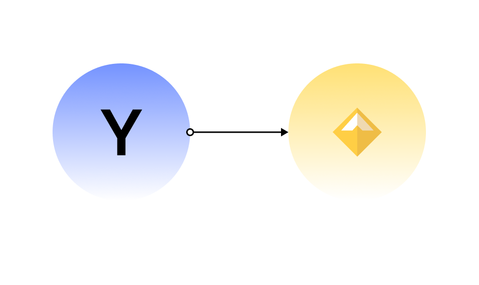

# Yield Protocol

Yield Protocol brings collateralized fixed-term borrowing, fixed-rate lending and interest rate markets to decentralized finance.

This solves a major pain point around today's DeFi lending protocols: **predictable interest rates**. Today's DeFi credit instituions offer only variable interest rates. 
Interest rate volatility can make it difficult for borrowers and lenders to plan for the future, make investment decisions, and properly hedge risk.

Yield Protocol allows you to have a "set and forget" experience, instead of constantly rebalancing your assets across DeFi in an effort to minimize your borrow rates or maximize your lending yields.
We do that with a new primitive, _fixed yield tokens_ also known as _fyTokens_. 

fyTokens are analogous to [zero-coupon bonds](https://www.investopedia.com/terms/z/zero-couponbond.asp). 

> A zero-coupon bond is a debt security that does not pay interest but instead trades at a deep discount, rendering a profit at maturity, when the bond is redeemed for its full face value

The interest rate is calculated by the difference between the discounted value and the underlying's value at maturity.

<figure class="image" align = "center">
  
  <figcaption><i>At maturity, yDai are redeemable for Dai one to one</i></figcaption>
   
</figure>

## An Example

_Note: The first version of Yield Protocol only supports fyDAI, so we will be using that throughout our examples_

Suppose you buy 1 fyDai that settles exactly a year from today for 0.95 Dai. Your yield is fixed because you have a fixed amount of invested capital (0.95 Dai) and a known amount of future return (1 Dai, a year from now).

A zero coupon bond's price is calculated by the following formula, where $$P$$ is the price of the bond, $$M$$ is the value of the underlying at maturity, $$r$$ is the interest rate and $$n$$ is the number of years to maturity.

$$
P = \frac{M}{(1 + r)^n}
$$

Plugging our values in the formula and solving for $$r$$ gives us our interest rate:

$$
0.95 = \frac{1}{(1 + r)^1} \leftrightarrow r = \frac{1}{0.95} - 1 = 0.0526
$$

## Next Steps

Now that you know how zero coupon bonds work, dive into the [Users](users/README.md) section if you want to learn how to use Yield Protocol, 
or into the [Developers](developers/README.md) if you are a developer looking to integrate with our smart contracts

## A statement from our team

Yield Protocol is built on MakerDAO, DeFi's biggest credit institution. Yield does not require any additional trusted intermediaries 
or governance processes and **was built to maximize decentralization, censorship resistance, and security**.

## Useful Links

- [Yield DApp](https://app.yield.is)
- [Yield Whitepaper](https://yield.is/whitepaper.pdf)
- [YieldSpace AMM Whitepaper](https://yield.is/yieldspace.pdf)

## Security

Responsible security disclosures should be sent to [security@yield.is](mailto:security@yield.is). Thank you
for keeping Yield safe!
