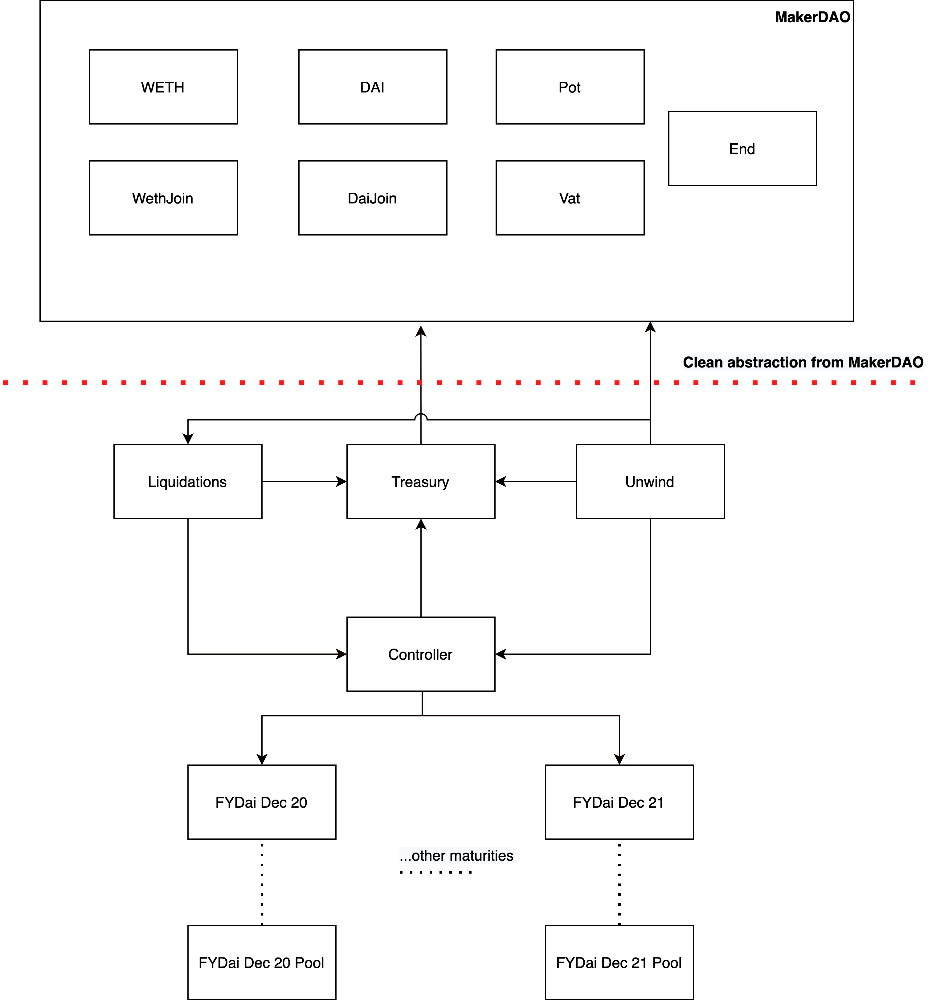
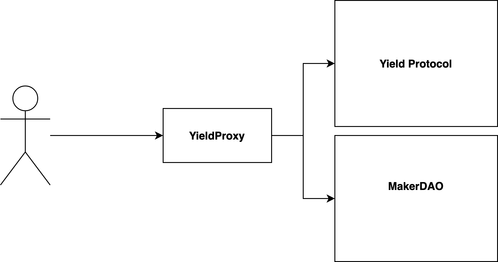

# Developer Documentation

The quickest place to get started is the fyDAI repository. Clone it and run the tests:

```bash
git clone https://github.com/yieldprotocol/fyDai/
yarn
yarn test
```

The Yield specification can be found [here](https://docs.google.com/document/d/1TSc63v0E9X_aqmAL5VeIM1GDpALsf6yHiq0wGpfnsns/edit?usp=sharing).

Yield Protocol is made up of the [core](contracts/core.md) contracts and the [periphery](contracts/periphery.md). 

The core is responsible for managing users' collateral, issuing and redeeming 
fyDAI and interacting with MakerDAO's contracts.

The periphery is responsible for providing convenience functions to the core, as well
as for allowing DAI-fyDAI trading.

Below you may see a high level graph of how the contracts interact with each other.

<figure class="image" align = "center">
  
  <figcaption><i>The Yield protocol architecture</i></figcaption>
  <br>
</figure>


Actions in Yield are multi-step processes. In order to improve UX we also 
provide a stateless proxy contract in order to batch together complex calls. The
YieldProxy is also used to convert Maker vaults to Yield vaults (and vice versa)
Users are expected to interface with the protocol via these proxy contacts.

<figure class="image" align = "center">
  
  <figcaption><i>The YieldProxy is the main entrypoint for users</i></figcaption>
  <br>
</figure>
