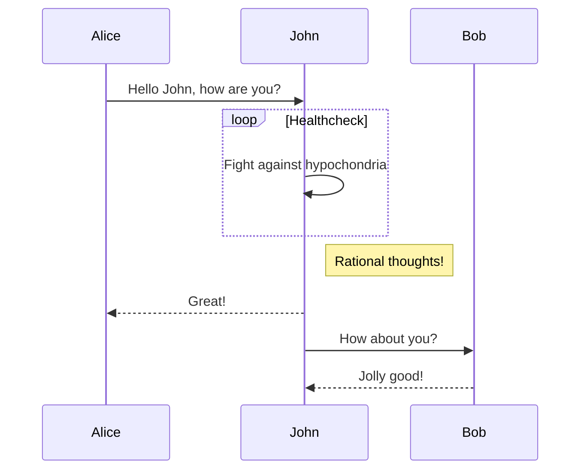

# Yield Architecture

The core is responsible for managing users' collateral, issuing and redeeming 
fyDAI and interacting with MakerDAO's contracts.

The core contracts are responsible for the management of collateral and debt, issuing and redeeming 
fyDAI and interacting with MakerDAO's contracts, amoung other functions:
 - `Treasury` is the single point of contact of the Yield Protocol with MakerDAO contracts, including Chai, for the purpose of asset management. 
 - `FYDai` contracts are ERC20 contracts that target a Chai value at a specific maturity, at which they can be redeemed for Dai.
 - `Controller` manages collateral and debt for all users, issuing FYDai tokens as debt is taken or burning them as it is repaid.
 - `Liquidations` allows to take over user accounts when they are undercollateralized, selling the colalteral to settle the outstanding debt.
 - `Unwind``allows to redeem fyDai, settle debt, and settle ongoing auctions in the event of a MakerDAO shutdown.

The pool contracts allow Dai-fyDai trading.

The periphery contracts are responsible for providing convenience functions to the frontend.

Below you may see a high level graph of how the contracts interact with each other

** TODO PROPER SEQUENCE CHART **

