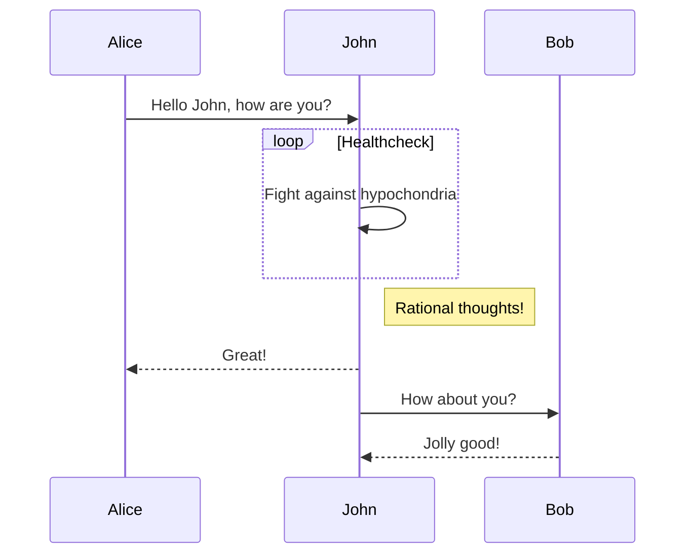

# Yield Architecture

The core is responsible for managing users' collateral, issuing and redeeming 
fyDAI and interacting with MakerDAO's contracts.

The periphery is responsible for providing convenience functions to the core, as well
as for allowing DAI-fyDAI trading.

Below you may see a high level graph of how the contracts interact with each other

** TODO PROPER SEQUENCE CHART **

