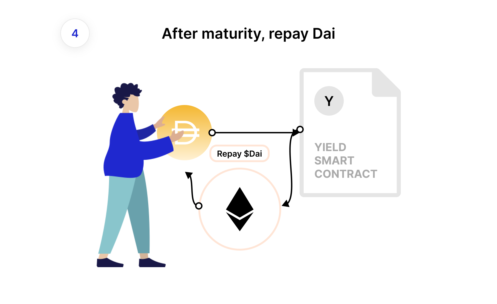

# Borrowing

Yield allows borrowing Dai against your ETH and pay a fixed rate. To improve liquidity, the Yield Protocol tokenizes the borrowing of Dai. To borrow, you deposit ETH in the protocol and draw new fyDai tokens against the collateral. You may proceed to sell the fyDai for Dai, locking in your borrowing rate. 

At maturity, you must repay the debt in Dai to reclaim your collateral. Of course, you may also repay your debt earlier than the maturity by returning the fyDai tokens you have drawn. Interest rate changes may affect (positively or negatively!) the amount of Dai you need to obtain the needed fyDai.
Be careful when repaying earlier as you may incur higher interest rates than paying at maturity.

  |  
:-------------------------:|:-------------------------:
  |  

## Example

Here’s an example of using the Yield protocol to borrow Dai, assuming ETH = $400, and a buyer for fyDAI 
(for users of the Yield App, the buyer will in practice be [YieldSpace](../developers/yieldspace.md), Yield's application specific automated market maker). 

1. You deposit 0.5 ETH of collateral (worth $200) in the system. This allows you to borrow up to 132 fyDai from any of the available maturities. 
1. You decide on Sept. 31, 2020 to borrow 100 fyDAI-DEC20 (fyDAI expiring on December 31, 2020).
1. You sell the fyDAI-DEC20 on the open market for 98.79 DAI

Effectively, you have borrowed 98.79 DAI today and have 100 DAI debt, due in 3 months. In other words, you have borrowed at 5% APR (**TODO: Is this correct? Explain how this is calculated, since it's not a full year loan**)

Plugging our values in the [present value formula](https://www.investopedia.com/terms/p/presentvalue.asp) and solving for $$r$$ gives us our interest rate:

$$
0.9879 = \frac{1}{(1 + r)^0.25} \leftrightarrow r = \frac{1}{0.9879}^\frac{1}{.25} - 1 = 0.05
$$

After maturity is reached on Dec. 31st, 2020, you may return and pay the 100 DAI debt.

## Maturity

After maturity, the Yield Protocol does not require that you pay back your debt. 

Instead, it charges you the Maker stability fee as if you were holding an ETH vault.

Due to that, you should try to close your position as soon as possible, or incur higher debt due to the stability fee. If your debt grows beyond your allowed collateralization ratios, you will be [liquidated](../developers/liquidation.md).

## A note on collateral

Borrowers must maintain a minimum amount of collateral in the system to secure the debt they owe. 

If a borrower fails to do so, they may be liquidated: their collateral will be seized and auctioned off to repay their debts. 

For ETH collateral, fyDAI uses the same collateralization ratio as MakerDAO, which is currently 150%.