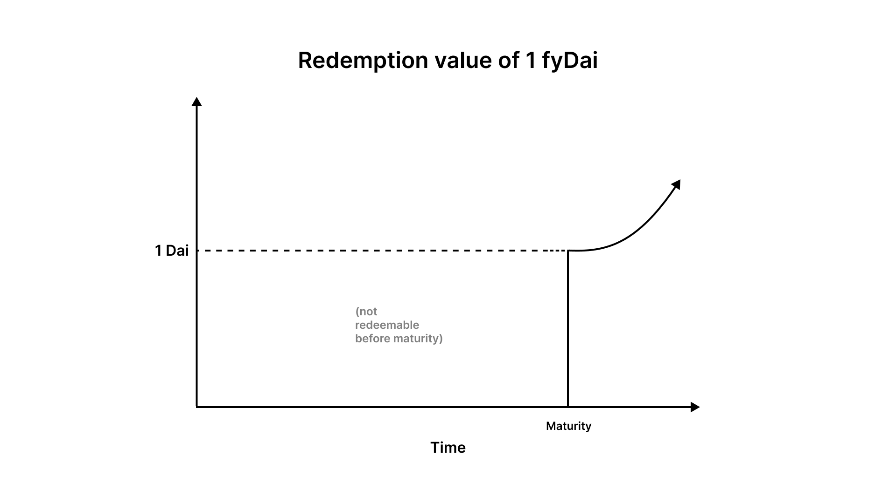

# Lending

Buying fyDai of any maturity with Dai can be thought of as lending DAI at a fixed rate.

The discount you receive from the face value of the fyDai locks in a fixed return that can be calculated based on the time to maturity. 

For example, if on September 31, 2020, you buy 100 fyDAI that matures in December 2020 for 98.8 DAI you will earn an implied rate of interest of 5% APR.

You can also exit your lending position early by selling your fyDai for Dai. Because fyDai is traded freely, changes in 
interest rates may affect the amount of Dai you receive when redeeming early.

Typically, you should be able to buy 1 fyDAI for less than 1 DAI because DeFi interest rates are positive. In a hypothetical
negative interest rate regime in DeFi, 1 fyDAI would be worth more than 1 DAI.

## Maturity

If you own fyDai after maturity, you will start to earn the Dai Savings Rate on your fyDai, until you decide to redeem it for Dai.

