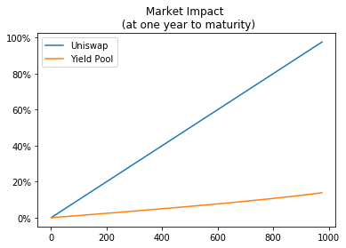

# Providing Liquidity

To improve the liquidity of fyDai, Yield has designed a new automated liquidity provider that is 
designed to enable efficient trading between Dai and fyDai. We call this new automated liquidity 
provider YieldSpace. We refer the reader to the [YieldSpace paper](https://yield.is/YieldSpace.pdf)
to get a deeper understanding of the calculations and the overall mechanism. The Yield App 
integrates YieldSpace seamlessly into the user experience.  

YieldSpace pools improve on existing solutions by providing markets that quote at
consistent interest rates over time, in the absence of trades. By quoting at a consistent 
interest rate, YieldSpace pools minimize losses from arbitrage. 

Whereas in Uniswap, arbitrage  trades are expected whenever prices change, 
**arbitrage trades in the YieldSpace Pool are expected to occur only when interest rates change.** 
This should tend to reduce the “impermanent loss” suffered by market makers.

Like other automated liquidity providers, users may choose to provide liquidity to 
YieldSpace pools to earn fees from future trades. YieldSpace uses a custom fee model 
that is optimized for fyDai. Rather than charge a fee that is a percentage of the amount 
of the asset bought or sold, **YieldSpace charges a fee that is proportional to both 
interest rate and time to maturity**. This fee model ensures that fees never result in 
an unreasonably wide spread on interest rates paid by borrowers (fyDai sellers) 
and earned by lenders (fyDai buyers).

Similarly to Uniswap, providing liquidity to YieldSpace will grant you Liquidity Provider shares.
If you are providing liquidity for fyDai21Sep30, you get fyDaiLP21Sep30 tokens which represent
your share of the pool. These tokens are ERC20 tokens and may be further composed in the DeFi ecosystem.

One YieldSpace pool is deployed _for each_ fyDAI maturity. Swapping fyDAI with different maturities needs
to be done manually by selling fyDAI-A to its pool, getting DAI and then buying fyDAI-B with the obtained DAI.

## Market Impact

The Yield Pool formula reduces the market impact suffered by traders of fyDai, especially 
for fyDai that is closer to maturity. The chart below illustrates the market impact 
that trades of equivalent size would cause on Uniswap versus the Yield Pool, assuming 
both are initialized with reserves of 1000 Dai and 1000 fyDai. 

The x-axis is the amount of fyDai sold. The y-axis is the implicit interest rate 
achieved by a borrower who is selling that amount of fyDai at one year to maturity. 
Borrowers obtain considerably better fyDai/Dai quotes (with better implied interest rates)
by using the Yield Pool.

<figure class="image" align = "center">
  
  <figcaption><i>YieldSpace consistently outperforms Uniswap on both interest rates and market quotes</i></figcaption>
   
</figure>
